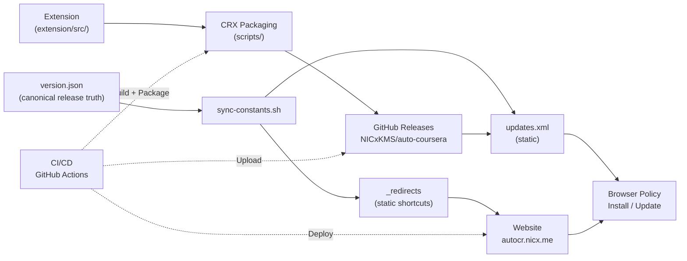

# Auto-Coursera Assistant — Distribution Platform

A complete browser extension distribution platform for **Auto-Coursera Assistant**, an AI-powered Chrome extension that helps with Coursera quizzes. This monorepo contains the extension source, CRX packaging scripts, native installer tooling, and the static website/update surfaces that ship releases.

> **Current release:** **`v2.0.0`** introduces NumericQuestion support, a narrative-driven scrollytelling website redesign, and a major extension architecture overhaul with circuit-breaker failover across five AI providers.

## Architecture



## Quick Start

```bash
# 1. Clone the repository
git clone https://github.com/nicxkms/auto-coursera.git
cd auto-coursera

# 2. Install extension dependencies
cd extension && pnpm install && cd ..

# 3. Build the extension
cd extension && pnpm build && cd ..

# 4. Generate a signing key (first time only)
bash scripts/generate-key.sh

# 5. Package as CRX
bash scripts/package-crx.sh -v <version> -k extension-key.pem -s extension/dist
```

## Prerequisites

| Requirement          | Version  | Purpose                              |
|----------------------|----------|--------------------------------------|
| Node.js              | 20+      | Extension build, CRX packaging       |
| pnpm                 | 9+       | Package manager                      |
| Go                   | 1.22+    | Installer service                    |
| Cloudflare account   | —        | Pages hosting                        |
| GitHub account       | —        | Source control, CI/CD, Releases      |
| OpenSSL              | 3+       | CRX signing, key generation          |

## Components

| Component        | Path             | Description                                          |
|------------------|------------------|------------------------------------------------------|
| **Extension**    | `extension/`     | Chrome MV3 extension with multi-provider AI (OpenRouter, Gemini, Groq, Cerebras, NVIDIA NIM), floating widget, settings overlay, circuit-breaker failover, and NumericQuestion support |
| **Source**       | `extension/src/` | Extension TypeScript source files                    |
| **Scripts**      | `scripts/`       | CRX packaging, key generation, version sync, update XML tooling, and cross-file version verification |
| **Website**      | `website/`       | Narrative-driven scrollytelling Astro 5 site with Technology Noir aesthetic, 11 page routes, build-time CHANGELOG parser, and static update manifest at autocr.nicx.me |
| **Installer**    | `installer/`     | Go-based browser-policy installer binaries           |
| **Docs**         | `docs/`          | Architecture, deployment, and operations guides      |
| **CI/CD**        | `.github/`       | GitHub Actions workflows and agent definitions       |

## Development

### Extension

```bash
cd extension
pnpm install
pnpm dev          # Build in watch mode
pnpm build        # Production build
pnpm test         # Run tests
pnpm typecheck    # TypeScript type checking
pnpm lint         # Biome lint
```

### CRX Packaging Scripts

```bash
# Generate a new signing key
bash scripts/generate-key.sh

# Package extension as CRX3
bash scripts/package-crx.sh -v <version> -k extension-key.pem -s extension/dist

# Optional: generate a local/manual updates.xml fixture for testing
bash scripts/generate-updates-xml.sh -i <extension-id> -v <version> -u <crx-url>

# Verify a CRX file
bash scripts/verify-crx.sh <file.crx>
```

### Website

```bash
cd website
pnpm install
pnpm dev          # Dev server at localhost:4321
pnpm build        # Production build
```

### Installer

```bash
cd installer
go build -o dist/installer .

# Build all platforms
make build-all
```

## Deployment

Deployment guides are available in the `docs/` directory:

- **[`docs/ARCHITECTURE.md`](docs/ARCHITECTURE.md)** — System architecture details
- **[`docs/SETUP.md`](docs/SETUP.md)** — Full deployment walkthrough
- **[`docs/TROUBLESHOOTING.md`](docs/TROUBLESHOOTING.md)** — Troubleshooting common issues
- **Live website summaries** — [`/docs/architecture`](https://autocr.nicx.me/docs/architecture) and [`/docs/setup`](https://autocr.nicx.me/docs/setup) provide shorter public overviews that link back to the full repository docs

### Quick Deployment Summary

1. **Build extension** → `cd extension && pnpm build`
2. **Package CRX** → `bash scripts/package-crx.sh -v <ver> -k extension-key.pem`
3. **Upload to GitHub Releases** → CI/CD creates a GitHub Release with the CRX, CRX checksum, installers, and installer checksums
4. **Deploy website** → CI runs `wrangler pages deploy website/dist --project-name=auto-coursera --branch=master`, but `deploy-website-main` only publishes when the current `version.json` already has a matching published GitHub Release with the expected assets

GitHub Releases stores the CRX and installer binaries, while the static Astro website on Cloudflare Pages serves the landing page, docs, and the canonical `updates.xml` update manifest at `https://autocr.nicx.me/updates.xml`.

End-user installs and updates are driven by browser policy entries (`ExtensionInstallForcelist`) written by the native installer, install scripts, or manual policy steps. The site intentionally treats installers as the primary path; scripts and manual steps remain available for advanced or automated environments.

## Configuration Variables

| Variable               | Value                       | Description                         |
|------------------------|-----------------------------|-------------------------------------|
| `PROJECT_NAME`         | `auto-coursera`             | Repository and project name         |
| `EXTENSION_NAME`       | `Auto-Coursera Assistant`   | Chrome extension display name       |
| `EXTENSION_ID`         | `alojpdnpiddmekflpagdblmaehbdfcge`  | Chrome extension ID (from key)      |
| `DOMAIN_WEBSITE`       | `autocr.nicx.me`          | Landing page and update manifest domain |
| `GITHUB_REPO`          | `NICxKMS/auto-coursera`    | GitHub repository (Releases host)   |

## License

[MIT](LICENSE) © 2024-2026 nicx
