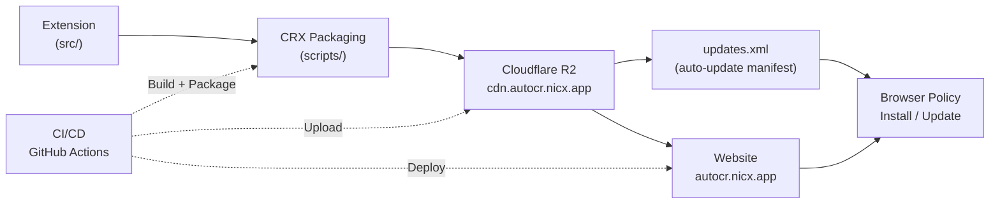

# Auto-Coursera Assistant — Distribution Platform

A complete browser extension distribution platform for **Auto-Coursera Assistant**, an AI-powered Chrome extension that helps with Coursera quizzes. This monorepo contains the extension source, CRX packaging scripts, installer service, update infrastructure, and landing website.

## Architecture



## Quick Start

```bash
# 1. Clone the repository
git clone https://github.com/nicxkms/auto-coursera.git
cd auto-coursera

# 2. Install extension dependencies
cd extension && pnpm install && cd ..

# 3. Build the extension
cd extension && pnpm build && cd ..

# 4. Generate a signing key (first time only)
bash scripts/generate-key.sh

# 5. Package as CRX
bash scripts/package-crx.sh -v 1.7.5 -k extension-key.pem -s extension/dist
```

## Prerequisites

| Requirement          | Version  | Purpose                              |
|----------------------|----------|--------------------------------------|
| Node.js              | 20+      | Extension build, CRX packaging       |
| pnpm                 | 9+       | Package manager                      |
| Go                   | 1.22+    | Installer service                    |
| Cloudflare account   | —        | R2 storage, Workers, Pages           |
| GitHub account       | —        | Source control, CI/CD, Releases      |
| OpenSSL              | 3+       | CRX signing, key generation          |

## Components

| Component        | Path             | Description                                          |
|------------------|------------------|------------------------------------------------------|
| **Extension**    | `extension/`     | Chrome MV3 extension source (TypeScript, Webpack)    |
| **Source**       | `src/`           | Extension TypeScript source files                    |
| **Scripts**      | `scripts/`       | CRX packaging, key generation, update XML tools      |
| **Website**      | `website/`       | Astro landing page at autocr.nicx.app               |
| **Installer**    | `installer/`     | Go-based installer service                           |
| **Workers**      | `workers/`       | Cloudflare Workers API at api.autocr.nicx.app               |
| **Docs**         | `docs/`          | Architecture, deployment, and operations guides      |
| **CI/CD**        | `.github/`       | GitHub Actions workflows and agent definitions       |

## Development

### Extension

```bash
cd extension
pnpm install
pnpm dev          # Build in watch mode
pnpm build        # Production build
pnpm test         # Run tests
pnpm typecheck    # TypeScript type checking
pnpm lint         # Biome lint
```

### CRX Packaging Scripts

```bash
# Generate a new signing key
bash scripts/generate-key.sh

# Derive extension ID from existing key
bash scripts/derive-extension-id.sh extension-key.pem

# Package extension as CRX3
bash scripts/package-crx.sh -v <version> -k extension-key.pem -s extension/dist

# Generate updates.xml for auto-update
bash scripts/generate-updates-xml.sh -i <extension-id> -v <version> -u <crx-url>

# Verify a CRX file
bash scripts/verify-crx.sh <file.crx>
```

### Website

```bash
cd website
pnpm install
pnpm dev          # Dev server at localhost:4321
pnpm build        # Production build
```

### Installer

```bash
cd installer
go build -o dist/installer .

# Build all platforms
make build-all
```

## Deployment

Deployment guides are available in the `docs/` directory:

- **[`docs/ARCHITECTURE.md`](docs/ARCHITECTURE.md)** — System architecture details
- **[`docs/SETUP.md`](docs/SETUP.md)** — Full deployment walkthrough
- **[`docs/TROUBLESHOOTING.md`](docs/TROUBLESHOOTING.md)** — Troubleshooting common issues

### Quick Deployment Summary

1. **Build extension** → `cd extension && pnpm build`
2. **Package CRX** → `bash scripts/package-crx.sh -v <ver> -k extension-key.pem`
3. **Upload to R2** → CI/CD uploads CRX + updates.xml to `cdn.autocr.nicx.app`
4. **Deploy website** → Cloudflare Pages auto-deploys from `website/`
5. **Deploy workers** → `cd workers && wrangler deploy`

## Configuration Variables

| Variable               | Value                       | Description                         |
|------------------------|-----------------------------|-------------------------------------|
| `PROJECT_NAME`         | `auto-coursera`             | Repository and project name         |
| `EXTENSION_NAME`       | `Auto-Coursera Assistant`   | Chrome extension display name       |
| `EXTENSION_ID`         | `alojpdnpiddmekflpagdblmaehbdfcge`  | Chrome extension ID (from key)      |
| `DOMAIN_WEBSITE`       | `autocr.nicx.app`          | Landing page domain                 |
| `DOMAIN_EXTENSIONS`    | `cdn.autocr.nicx.app`       | CRX hosting domain (R2)            |
| `DOMAIN_API`           | `api.autocr.nicx.app`              | API worker domain                   |
| `R2_EXTENSIONS_BUCKET` | `extensions-bucket`         | R2 bucket for CRX files             |
| `R2_RELEASES_BUCKET`   | `releases-bucket`           | R2 bucket for release metadata      |
| `GITHUB_REPO`          | `nicx/auto-coursera`        | GitHub repository                   |

## License

[MIT](LICENSE) © 2024-2026 nicx
