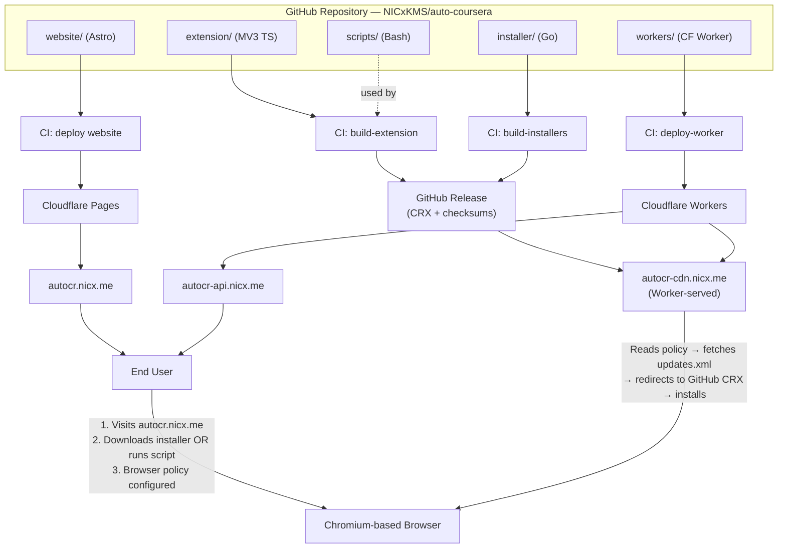
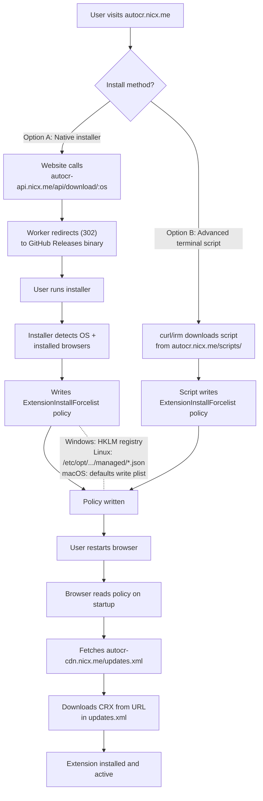
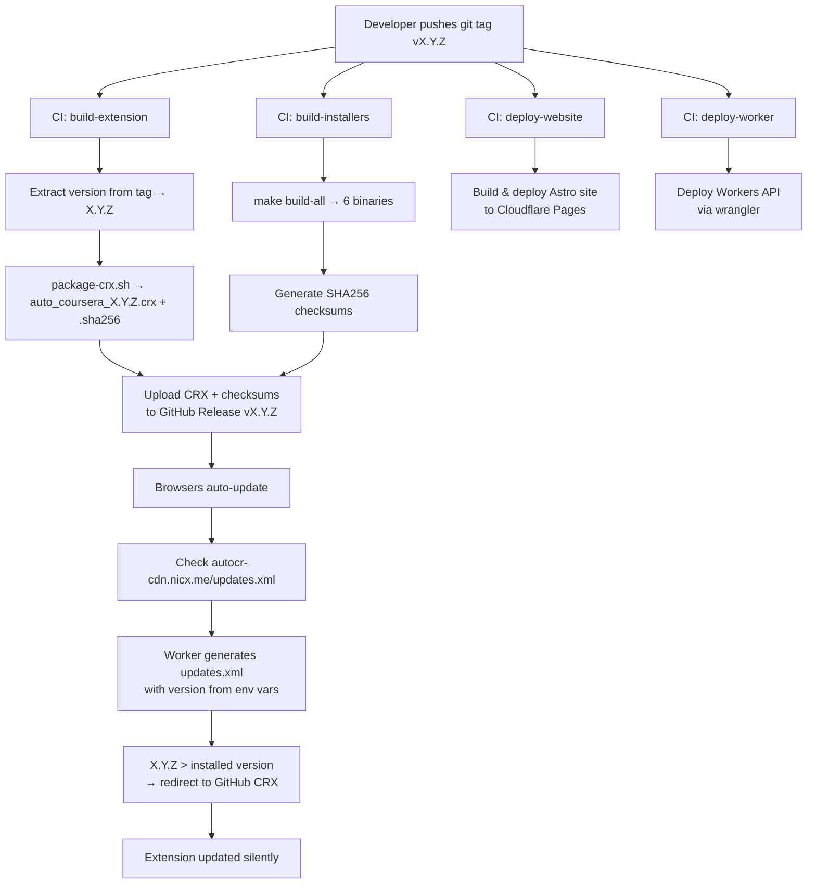
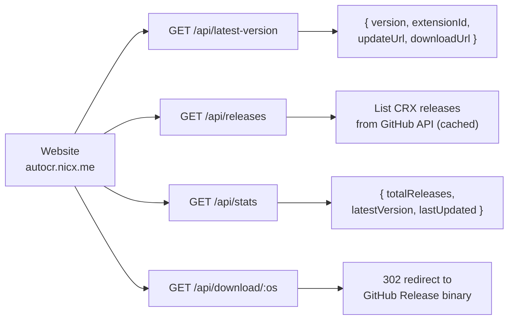

# Architecture

> Auto-Coursera Assistant — Extension Distribution Platform

---

## Table of Contents

- [System Overview](#system-overview)
- [Component Diagram](#component-diagram)
- [Component Descriptions](#component-descriptions)
  - [Chrome Extension](#chrome-extension)
  - [Website](#website-cloudflare-pages)
  - [Native Installer](#native-installer-go)
  - [Terminal Scripts](#terminal-install-scripts)
  - [Workers API](#workers-api-cloudflare-workers)
  - [CRX Packaging Scripts](#crx-packaging-scripts)
  - [CI/CD Pipeline](#cicd-pipeline-github-actions)
- [Data Flow Diagrams](#data-flow-diagrams)
  - [Install Flow](#install-flow)
  - [Release Flow](#release-flow)
  - [API Flow](#api-flow)
- [Domain Structure](#domain-structure)
- [Browser Policy Mechanism](#browser-policy-mechanism)
  - [Windows — Registry](#windows--registry)
  - [Linux — Managed Policy JSON](#linux--managed-policy-json)
  - [macOS — User Defaults (plist)](#macos--user-defaults-plist)
  - [Supported Browsers](#supported-browsers)

---

## System Overview

**Auto-Coursera Assistant** is an AI-powered Chrome extension that assists users on Coursera. The extension itself (Manifest V3, TypeScript, Webpack) is already built and lives in `extension/`.

This repository wraps it in a **complete distribution platform** so the extension can be self-hosted, installed via browser policy, automatically updated, and built/released through CI/CD — all without the Chrome Web Store.

The platform answers three questions:

1. **How does a user install the extension?** — Via a website that leads with native installer binaries. Advanced users can also use terminal scripts or manual policy steps. All three paths configure browser *policy* to force-install the extension from a self-hosted update URL.
2. **Where does the extension binary live?** — As a signed CRX3 file on GitHub Releases. A Cloudflare Worker fronts the CDN domain (`autocr-cdn.nicx.me`), dynamically generating `updates.xml` and redirecting CRX download requests to GitHub.
3. **How are new versions released?** — A developer pushes a `v*` tag. GitHub Actions builds the CRX, builds cross-platform installers, uploads everything to a GitHub Release, and deploys the website and API.

---

## Component Diagram



---

## Component Descriptions

### Chrome Extension

| | |
|---|---|
| **Location** | `extension/` (source in `extension/src/`) |
| **Stack** | Manifest V3, TypeScript, Webpack |
| **Version** | 1.8.0 |

The extension is an AI-powered assistant for Coursera. It uses a background service worker, content scripts injected into `coursera.org`, a popup UI, and an options page. It communicates with multiple AI providers (OpenRouter, Gemini, Groq, Cerebras, NVIDIA NIM) to process quiz questions.

Key release/distribution facts for the extension:

- `version` — stamped by CI during the build.
- Install and update discovery are **policy-driven**, not packaging-driven. The installer, terminal scripts, and manual steps all write `<extension-id>;<update-url>` into `ExtensionInstallForcelist`, and browsers then poll `https://autocr-cdn.nicx.me/updates.xml`.

The extension source code is **not modified** by this platform beyond the normal release build/signing flow. The platform wraps it for distribution.

---

### Website (Cloudflare Pages)

| | |
|---|---|
| **Location** | `website/` |
| **Stack** | Astro, Tailwind CSS, Cloudflare Pages adapter |
| **Domain** | `autocr.nicx.me` |
| **Build** | `pnpm build` → static output in `website/dist/` |

The website is the user-facing entry point. It provides:

- **Landing page** — what the extension does, supported browsers, CTA to install
- **Install page** — OS detection, native installers as the recommended path, with advanced terminal commands for scripted installs
- **Downloads page** — native installers first, plus advanced scripts and direct download shortcuts
- **Releases page** — version history fetched from the Workers API / GitHub Releases metadata
- **Documentation** — advanced manual install steps, troubleshooting guides, policy file paths
- **Static install scripts** — served from `/scripts/` (install.ps1, install.sh, install-mac.sh, uninstall.ps1, uninstall.sh)

Security headers are configured in `website/public/_headers` (HSTS, CSP, X-Frame-Options).
Redirect shortcuts are defined in `website/public/_redirects` (e.g., `/download/windows` → API).

---

### Native Installer (Go)

| | |
|---|---|
| **Location** | `installer/` |
| **Language** | Go 1.22+ |
| **Dependencies** | `golang.org/x/sys` (Windows registry) |
| **Build** | `make build-all` → binaries in `installer/dist/` |

A cross-platform CLI tool that configures browser policies to force-install the extension. The installer:

1. Detects the operating system (`runtime.GOOS`)
2. Scans for installed Chromium-based browsers (registry on Windows, `exec.LookPath` on Linux, `/Applications/*.app` + PATH on macOS)
3. Presents a selection prompt (or accepts `--browser` flag)
4. Writes the `ExtensionInstallForcelist` policy for each selected browser
5. Verifies the policy was written correctly
6. Prints a colored summary table

**Build targets** (from `Makefile`):

| Target | GOOS/GOARCH | Output |
|---|---|---|
| `build-windows` | windows/amd64 | `installer-windows-amd64.exe` |
| `build-windows-arm` | windows/arm64 | `installer-windows-arm64.exe` |
| `build-macos` | darwin/arm64 | `installer-macos-arm64` |
| `build-macos-intel` | darwin/amd64 | `installer-macos-amd64` |
| `build-linux` | linux/amd64 | `installer-linux-amd64` |
| `build-linux-arm64` | linux/arm64 | `installer-linux-arm64` |

**CLI flags:**

```
--browser <name>   Target a specific browser (chrome, edge, brave, chromium, all)
--uninstall        Remove extension policies instead of installing
--quiet            Non-interactive mode, skip prompts
--help             Show usage
```

---

### Terminal Install Scripts

| | |
|---|---|
| **Location** | `website/public/scripts/` |
| **Served at** | `https://autocr.nicx.me/scripts/` |

Advanced one-liner scripts for users who prefer the terminal, need automation, or are working in shell-first environments instead of downloading a binary.

| Script | Platform | Invocation |
|---|---|---|
| `install.ps1` | Windows (PowerShell) | `irm https://autocr.nicx.me/scripts/install.ps1 \| iex` |
| `install.sh` | Linux (Bash) | `curl -fsSL https://autocr.nicx.me/scripts/install.sh \| sudo bash` |
| `install-mac.sh` | macOS (Bash) | `curl -fsSL https://autocr.nicx.me/scripts/install-mac.sh \| bash` |
| `uninstall.ps1` | Windows (PowerShell) | `irm https://autocr.nicx.me/scripts/uninstall.ps1 \| iex` |
| `uninstall.sh` | Linux/macOS (Bash) | `curl -fsSL https://autocr.nicx.me/scripts/uninstall.sh \| sudo bash` |

Each script:

- Checks for required privileges (Administrator on Windows, root on Linux)
- Detects installed browsers
- Writes browser policy (registry on Windows, JSON on Linux, `defaults write` on macOS)
- Handles idempotency — skips if the policy already exists
- Supports `--uninstall` / `-Uninstall` to reverse the operation
- Prints colored status output

---

### Workers API (Cloudflare Workers)

| | |
|---|---|
| **Location** | `workers/` |
| **Stack** | Cloudflare Workers, TypeScript, Wrangler |
| **Domains** | `autocr-api.nicx.me` (API), `autocr-cdn.nicx.me` (CDN) |

The Worker serves two domains via dual-domain routing:

- **API domain** (`autocr-api.nicx.me`) — REST endpoints the website calls for version info, release lists, stats, and installer download redirects. CORS enabled.
- **CDN domain** (`autocr-cdn.nicx.me`) — Dynamically generates `updates.xml` and redirects CRX download requests to GitHub Releases. No CORS.

All binary artifacts are stored on GitHub Releases. The Worker proxies the GitHub API (with 5-minute cache) and generates 302 redirects to GitHub download URLs.

**API Endpoints:**

| Method | Path | Description |
|---|---|---|
| `GET` | `/api/health` | Health check |
| `GET` | `/api/latest-version` | Current version, extension ID, update/download URLs |
| `GET` | `/api/releases` | All CRX releases (from GitHub API, cached 5 min) |
| `GET` | `/api/download/:os` | 302 redirect to GitHub Release installer binary |
| `GET` | `/api/stats` | Aggregate stats from GitHub API |
| `OPTIONS` | `/*` | CORS preflight handler |

**CDN Endpoints:**

| Method | Path | Description |
|---|---|---|
| `GET` | `/updates.xml` | Dynamically generated Chrome update manifest |
| `GET` | `/releases/*.crx` | 302 redirect to GitHub Release CRX |
| `GET` | `/releases/*.crx.sha256` | 302 redirect to GitHub Release checksum |

**Environment variables** (set in `wrangler.toml`):

| Variable | Value |
|---|---|
| `EXTENSION_ID` | `alojpdnpiddmekflpagdblmaehbdfcge` |
| `CURRENT_VERSION` | `1.8.0` |
| `ALLOWED_ORIGIN` | `https://autocr.nicx.me` |
| `CDN_BASE_URL` | `https://autocr-cdn.nicx.me` |
| `GITHUB_REPO` | `NICxKMS/auto-coursera` |

**Download mapping** (`/api/download/:os`):

| OS | Binary redirected to (GitHub Release) |
|---|---|
| `windows` | `installer-windows-amd64.exe` |
| `windows-arm64` | `installer-windows-arm64.exe` |
| `macos` | `installer-macos-arm64` |
| `macos-intel` | `installer-macos-amd64` |
| `linux` | `installer-linux-amd64` |
| `linux-arm64` | `installer-linux-arm64` |

---

### CRX Packaging Scripts

| | |
|---|---|
| **Location** | `scripts/` |
| **Dependencies** | `openssl`, `xxd`, `npx crx3` |

Shell scripts that handle extension signing, packaging, and verification.

| Script | Purpose |
|---|---|
| `generate-key.sh` | Generate RSA 2048 private key (`extension-key.pem`), print derived extension ID |
| `derive-extension-id.sh` | Derive the 32-character extension ID from an existing private key |
| `package-crx.sh` | Build a signed CRX3 file from `extension/dist/` using `npx crx3`, generate SHA256 checksum |
| `generate-updates-xml.sh` | Produce a local/manual `updates.xml` fixture for testing; production uses the Worker-served `/updates.xml` route |
| `verify-crx.sh` | Validate a CRX3 file: magic bytes, format version, manifest, file size, checksum |

See [SIGNING.md](./SIGNING.md) for the full cryptographic details.

---

### CI/CD Pipeline (GitHub Actions)

| | |
|---|---|
| **Location** | `.github/workflows/` |
| **Triggers** | Push to the website deployment branch (`master` in the current setup), push `v*` tag (full release) |

**Workflows:**

| Workflow | Trigger | What it does |
|---|---|---|
| `deploy.yml` | website-branch push (`master` in the current setup) + `v*` tag | Orchestrates the full pipeline. Contains jobs: `build-extension`, `build-installers`, `create-release`, `deploy-website-main`, `deploy-website-release`, `deploy-worker` |
| `build-extension.yml` | `pull_request` + `workflow_dispatch` | CI build & test for PRs touching `extension/` (no secrets, no release) |
| `build-installers.yml` | `pull_request` + `workflow_dispatch` | CI build for PRs touching `installer/` (no secrets, no release) |
| `deploy-worker.yml` | `workflow_dispatch` | Manual Worker deploy outside of tagged releases |

**Required GitHub Secrets:**

| Secret | Purpose |
|---|---|
| `CF_ACCOUNT_ID` | Cloudflare account identifier |
| `CF_API_TOKEN` | Cloudflare API token (Pages + Workers permissions) |
| `EXTENSION_PRIVATE_KEY` | PEM private key content for CRX signing |
| `EXTENSION_ID` | Derived 32-character extension ID |

---

## Data Flow Diagrams

### Install Flow



### Release Flow



### API Flow



---

## Domain Structure

All domains are subdomains of `nicx.me`, managed in Cloudflare DNS.

| Domain | Service | Purpose |
|---|---|---|
| `autocr.nicx.me` | Cloudflare Pages | User-facing website. Landing page, install instructions, download links, documentation. Serves static install scripts from `/scripts/`. |
| `autocr-cdn.nicx.me` | Cloudflare Worker (CDN route) | Serves dynamically generated `updates.xml` and redirects CRX download requests to GitHub Releases. Browsers poll `updates.xml` to discover new versions. This URL is embedded in browser policies. |
| `autocr-api.nicx.me` | Cloudflare Workers | REST API. Provides version info, release listings, and installer download redirects (302 to GitHub). Called by the website's JavaScript. |

**Why three separate subdomains?**

- **Separation of concerns** — the website, CDN endpoints, and API are independent services that can be scaled, cached, and secured differently.
- **Caching** — `updates.xml` needs a short TTL (5 min) while CRX files are served via GitHub Releases with its own CDN. Static website assets have their own cache rules.
- **CORS** — the API allows requests only from `autocr.nicx.me`. CDN endpoints are requested directly by the browser (no CORS needed).

---

## Browser Policy Mechanism

Chromium-based browsers support enterprise policies that can **force-install** extensions without user interaction. The `ExtensionInstallForcelist` policy tells the browser: *"Install this extension from this URL and keep it updated."*

The policy value format is:

```
<extension-id>;<update-url>
```

For this project:

```
alojpdnpiddmekflpagdblmaehbdfcge;https://autocr-cdn.nicx.me/updates.xml
```

Once the policy is set, the browser:

1. Reads the policy on startup
2. Fetches the `updates.xml` from the update URL
3. Compares the version in `updates.xml` to any installed version
4. Downloads the CRX file if the remote version is newer (or not yet installed)
5. Verifies the CRX signature matches the extension ID
6. Installs or updates the extension silently

Users can verify policies are active by visiting `chrome://policy` in their browser.

---

### Windows — Registry

Policy is stored as a numbered string value under an `ExtensionInstallForcelist` registry key in `HKEY_LOCAL_MACHINE`.

| Browser | Registry Path |
|---|---|
| Chrome | `HKLM\SOFTWARE\Policies\Google\Chrome\ExtensionInstallForcelist` |
| Edge | `HKLM\SOFTWARE\Policies\Microsoft\Edge\ExtensionInstallForcelist` |
| Brave | `HKLM\SOFTWARE\Policies\BraveSoftware\Brave\ExtensionInstallForcelist` |
| Chromium | `HKLM\SOFTWARE\Policies\Chromium\ExtensionInstallForcelist` |

Each extension is a numbered value (`1`, `2`, `3`, ...) containing the policy string.

**Requires Administrator privileges** to write to HKLM.

---

### Linux — Managed Policy JSON

Policy is a JSON file in the browser's managed policy directory. The file must be readable by the browser process (permissions `644`).

| Browser | Policy Directory |
|---|---|
| Chrome | `/etc/opt/chrome/policies/managed/` |
| Edge | `/etc/opt/edge/policies/managed/` |
| Brave | `/etc/brave/policies/managed/` |
| Chromium | `/etc/chromium/policies/managed/` |

The installer and Linux shell scripts both write `auto_coursera.json`:

```json
{
    "ExtensionInstallForcelist": [
        "alojpdnpiddmekflpagdblmaehbdfcge;https://autocr-cdn.nicx.me/updates.xml"
    ]
}
```

Multiple extensions can coexist in the array. Existing policy files are read and merged — the installer never overwrites other extensions' policies.

**Requires root** because `/etc` is owned by root.

---

### macOS — User Defaults (plist)

Policy is set via the `defaults` command, which writes to the user's `~/Library/Preferences/` plist files.

| Browser | Plist Domain |
|---|---|
| Chrome | `com.google.Chrome` |
| Edge | `com.microsoft.Edge` |
| Brave | `com.brave.Browser` |
| Chromium | `org.chromium.Chromium` |

Commands used:

```bash
# Create new policy array
defaults write com.google.Chrome ExtensionInstallForcelist -array "EXTENSION_ID;https://autocr-cdn.nicx.me/updates.xml"

# Append to existing array
defaults write com.google.Chrome ExtensionInstallForcelist -array-add "EXTENSION_ID;https://autocr-cdn.nicx.me/updates.xml"

# Read current policy
defaults read com.google.Chrome ExtensionInstallForcelist

# Remove policy
defaults delete com.google.Chrome ExtensionInstallForcelist
```

**Does not require root** — user-level plist preferences.

---

### Supported Browsers

| Browser | Windows | Linux | macOS |
|---|---|---|---|
| Google Chrome | ✓ | ✓ | ✓ |
| Microsoft Edge | ✓ | ✓ | ✓ |
| Brave | ✓ | ✓ | ✓ |
| Chromium | ✓ | ✓ | ✓ |

All four browsers use the same Chromium policy mechanism. The only differences are the registry paths (Windows), policy directories (Linux), and plist domains (macOS).
