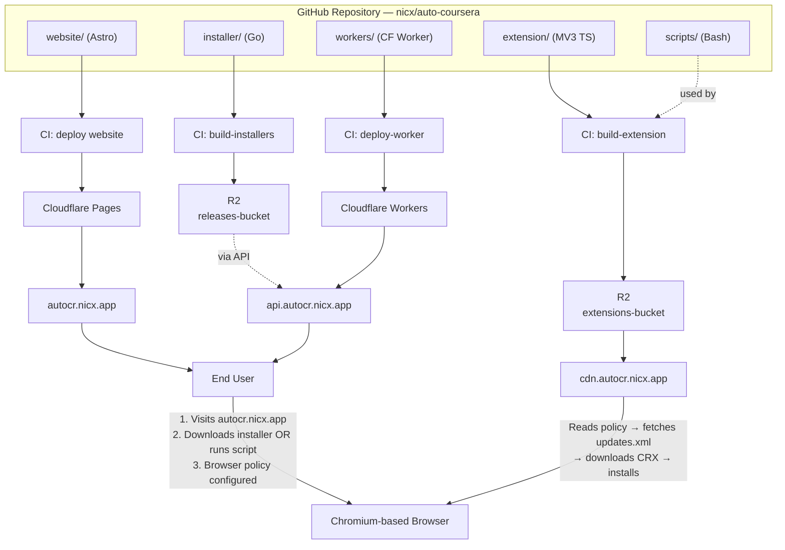
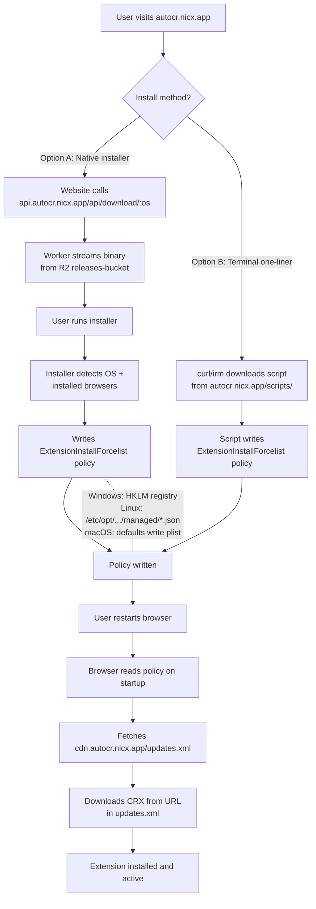
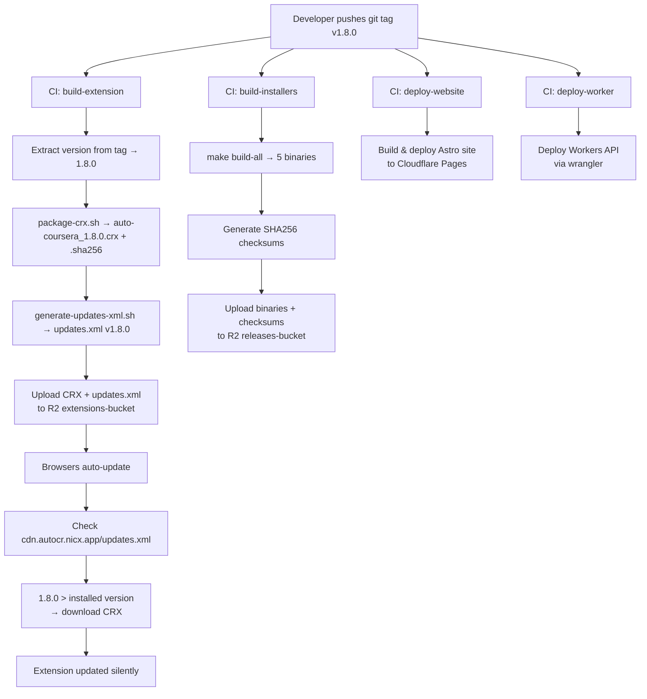
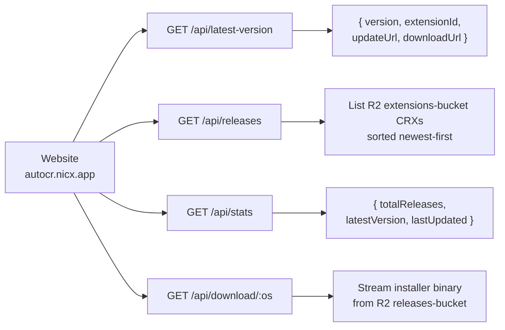

# Architecture

> Auto-Coursera Assistant — Extension Distribution Platform

---

## Table of Contents

- [System Overview](#system-overview)
- [Component Diagram](#component-diagram)
- [Component Descriptions](#component-descriptions)
  - [Chrome Extension](#chrome-extension)
  - [Website](#website-cloudflare-pages)
  - [Native Installer](#native-installer-go)
  - [Terminal Scripts](#terminal-install-scripts)
  - [Workers API](#workers-api-cloudflare-workers)
  - [CRX Packaging Scripts](#crx-packaging-scripts)
  - [CI/CD Pipeline](#cicd-pipeline-github-actions)
- [Data Flow Diagrams](#data-flow-diagrams)
  - [Install Flow](#install-flow)
  - [Release Flow](#release-flow)
  - [API Flow](#api-flow)
- [Domain Structure](#domain-structure)
- [Browser Policy Mechanism](#browser-policy-mechanism)
  - [Windows — Registry](#windows--registry)
  - [Linux — Managed Policy JSON](#linux--managed-policy-json)
  - [macOS — User Defaults (plist)](#macos--user-defaults-plist)
  - [Supported Browsers](#supported-browsers)

---

## System Overview

**Auto-Coursera Assistant** is an AI-powered Chrome extension that assists users on Coursera. The extension itself (Manifest V3, TypeScript, Webpack) is already built and lives in `extension/`.

This repository wraps it in a **complete distribution platform** so the extension can be self-hosted, installed via browser policy, automatically updated, and built/released through CI/CD — all without the Chrome Web Store.

The platform answers three questions:

1. **How does a user install the extension?** — Via a website that offers a native installer binary or a one-liner terminal script. Both configure browser *policy* to force-install the extension from a self-hosted update URL.
2. **Where does the extension binary live?** — As a signed CRX3 file in a Cloudflare R2 bucket, fronted by a custom domain and an `updates.xml` manifest that browsers poll for version changes.
3. **How are new versions released?** — A developer pushes a `v*` tag. GitHub Actions builds the CRX, builds cross-platform installers, uploads everything to R2, and deploys the website and API.

---

## Component Diagram



---

## Component Descriptions

### Chrome Extension

| | |
|---|---|
| **Location** | `extension/` (source in `src/`) |
| **Stack** | Manifest V3, TypeScript, Webpack |
| **Version** | 1.7.5 |

The extension is an AI-powered assistant for Coursera. It uses a background service worker, content scripts injected into `coursera.org`, a popup UI, and an options page. It communicates with multiple AI providers (OpenRouter, Gemini, Groq, Cerebras, NVIDIA NIM) to process quiz questions.

Key manifest fields for the distribution platform:

- `update_url` — points to `https://cdn.autocr.nicx.app/updates.xml` so the browser knows where to check for updates (added during CRX packaging).
- `version` — stamped by CI during the build.

The extension source code is **not modified** by this platform. The platform wraps it for distribution.

---

### Website (Cloudflare Pages)

| | |
|---|---|
| **Location** | `website/` |
| **Stack** | Astro, Tailwind CSS, Cloudflare Pages adapter |
| **Domain** | `autocr.nicx.app` |
| **Build** | `pnpm build` → static output in `website/dist/` |

The website is the user-facing entry point. It provides:

- **Landing page** — what the extension does, supported browsers, CTA to install
- **Install page** — OS detection, two install methods (native installer download or terminal one-liner), copy-to-clipboard commands
- **Downloads page** — all available binaries with version, size, and SHA256 checksums
- **Releases page** — version history fetched from the Workers API
- **Documentation** — manual install steps, troubleshooting guides, policy file paths
- **Static install scripts** — served from `/scripts/` (install.ps1, install.sh, install-mac.sh, uninstall.ps1, uninstall.sh)

Security headers are configured in `website/_headers` (HSTS, CSP, X-Frame-Options).
Redirect shortcuts are defined in `website/_redirects` (e.g., `/download/windows` → API).

---

### Native Installer (Go)

| | |
|---|---|
| **Location** | `installer/` |
| **Language** | Go 1.22+ |
| **Dependencies** | `golang.org/x/sys` (Windows registry) |
| **Build** | `make build-all` → binaries in `installer/dist/` |

A cross-platform CLI tool that configures browser policies to force-install the extension. The installer:

1. Detects the operating system (`runtime.GOOS`)
2. Scans for installed Chromium-based browsers (registry on Windows, `exec.LookPath` on Linux, `/Applications/*.app` + PATH on macOS)
3. Presents a selection prompt (or accepts `--browser` flag)
4. Writes the `ExtensionInstallForcelist` policy for each selected browser
5. Verifies the policy was written correctly
6. Prints a colored summary table

**Build targets** (from `Makefile`):

| Target | GOOS/GOARCH | Output |
|---|---|---|
| `build-windows` | windows/amd64 | `installer-windows-amd64.exe` |
| `build-windows-arm` | windows/arm64 | `installer-windows-arm64.exe` |
| `build-macos` | darwin/arm64 | `installer-macos-arm64` |
| `build-macos-intel` | darwin/amd64 | `installer-macos-amd64` |
| `build-linux` | linux/amd64 | `installer-linux-amd64` |

**CLI flags:**

```
--browser <name>   Target a specific browser (chrome, edge, brave, chromium, all)
--uninstall        Remove extension policies instead of installing
--quiet            Non-interactive mode, skip prompts
--help             Show usage
```

---

### Terminal Install Scripts

| | |
|---|---|
| **Location** | `website/public/scripts/` |
| **Served at** | `https://autocr.nicx.app/scripts/` |

One-liner scripts for users who prefer the terminal over downloading a binary.

| Script | Platform | Invocation |
|---|---|---|
| `install.ps1` | Windows (PowerShell) | `irm https://autocr.nicx.app/scripts/install.ps1 \| iex` |
| `install.sh` | Linux (Bash) | `curl -fsSL https://autocr.nicx.app/scripts/install.sh \| sudo bash` |
| `install-mac.sh` | macOS (Bash) | `curl -fsSL https://autocr.nicx.app/scripts/install-mac.sh \| bash` |
| `uninstall.ps1` | Windows (PowerShell) | `irm https://autocr.nicx.app/scripts/uninstall.ps1 \| iex` |
| `uninstall.sh` | Linux/macOS (Bash) | `curl -fsSL https://autocr.nicx.app/scripts/uninstall.sh \| sudo bash` |

Each script:

- Checks for required privileges (Administrator on Windows, root on Linux)
- Detects installed browsers
- Writes browser policy (registry on Windows, JSON on Linux, `defaults write` on macOS)
- Handles idempotency — skips if the policy already exists
- Supports `--uninstall` / `-Uninstall` to reverse the operation
- Prints colored status output

---

### Workers API (Cloudflare Workers)

| | |
|---|---|
| **Location** | `workers/` |
| **Stack** | Cloudflare Workers, TypeScript, Wrangler |
| **Domain** | `api.autocr.nicx.app` |
| **R2 bindings** | `EXTENSIONS_BUCKET`, `RELEASES_BUCKET` |

The API provides endpoints the website calls to display version info, release lists, and serve installer downloads.

**Endpoints:**

| Method | Path | Description |
|---|---|---|
| `GET` | `/api/latest-version` | Current version, extension ID, update/download URLs |
| `GET` | `/api/releases` | All CRX releases from R2, sorted newest-first |
| `GET` | `/api/download/:os` | Stream installer binary (windows, macos, linux) |
| `GET` | `/api/stats` | Total releases, latest version, last updated date |
| `OPTIONS` | `/*` | CORS preflight handler |

**Environment variables** (set in `wrangler.toml`):

| Variable | Value |
|---|---|
| `EXTENSION_ID` | `alojpdnpiddmekflpagdblmaehbdfcge` |
| `CURRENT_VERSION` | `1.7.5` |
| `ALLOWED_ORIGIN` | `https://autocr.nicx.app` |

**Download mapping** (`/api/download/:os`):

| OS | Binary served from `RELEASES_BUCKET` |
|---|---|
| `windows` | `installer-windows-amd64.exe` |
| `macos` | `installer-macos-arm64` |
| `linux` | `installer-linux-amd64` |

---

### CRX Packaging Scripts

| | |
|---|---|
| **Location** | `scripts/` |
| **Dependencies** | `openssl`, `xxd`, `npx crx3` |

Shell scripts that handle extension signing, packaging, and verification.

| Script | Purpose |
|---|---|
| `generate-key.sh` | Generate RSA 2048 private key (`extension-key.pem`), print derived extension ID |
| `derive-extension-id.sh` | Derive the 32-character extension ID from an existing private key |
| `package-crx.sh` | Build a signed CRX3 file from `extension/dist/` using `npx crx3`, generate SHA256 checksum |
| `generate-updates-xml.sh` | Produce the `updates.xml` auto-update manifest with extension ID, version, and CRX URL |
| `verify-crx.sh` | Validate a CRX3 file: magic bytes, format version, manifest, file size, checksum |

See [SIGNING.md](./SIGNING.md) for the full cryptographic details.

---

### CI/CD Pipeline (GitHub Actions)

| | |
|---|---|
| **Location** | `.github/workflows/` |
| **Triggers** | Push to `main` (website only), push `v*` tag (full release) |

**Workflows:**

| Workflow | Trigger | What it does |
|---|---|---|
| `deploy.yml` | `main` push + `v*` tag | Orchestrates the full pipeline |
| `build-extension.yml` | `v*` tag | Package CRX, upload to R2, regenerate `updates.xml` |
| `build-installers.yml` | `v*` tag | `make build-all`, upload binaries + checksums to R2 |
| `deploy-worker.yml` | `v*` tag | Deploy Workers API via Wrangler |

**Required GitHub Secrets:**

| Secret | Purpose |
|---|---|
| `CF_ACCOUNT_ID` | Cloudflare account identifier |
| `CF_API_TOKEN` | Cloudflare API token (Pages + R2 + Workers permissions) |
| `EXTENSION_PRIVATE_KEY` | PEM private key content for CRX signing |
| `EXTENSION_ID` | Derived 32-character extension ID |

---

## Data Flow Diagrams

### Install Flow



### Release Flow



### API Flow



---

## Domain Structure

All domains are subdomains of `nicx.app`, managed in Cloudflare DNS.

| Domain | Service | Purpose |
|---|---|---|
| `autocr.nicx.app` | Cloudflare Pages | User-facing website. Landing page, install instructions, download links, documentation. Serves static install scripts from `/scripts/`. |
| `cdn.autocr.nicx.app` | R2 custom domain | Hosts the CRX extension files and `updates.xml`. Browsers poll `updates.xml` to discover new versions. This is the URL embedded in browser policies. |
| `api.autocr.nicx.app` | Cloudflare Workers | REST API. Provides version info, release listings, and proxied installer downloads from R2. Called by the website's JavaScript. |

**Why three separate subdomains?**

- **Separation of concerns** — the website, extension files, and API are independent services that can be scaled, cached, and secured differently.
- **Caching** — `updates.xml` needs a short TTL (5 min) while CRX files can be cached for 24 hours. Static website assets have their own cache rules.
- **CORS** — the API allows requests only from `autocr.nicx.app`. Extension files are requested directly by the browser (no CORS needed).

---

## Browser Policy Mechanism

Chromium-based browsers support enterprise policies that can **force-install** extensions without user interaction. The `ExtensionInstallForcelist` policy tells the browser: *"Install this extension from this URL and keep it updated."*

The policy value format is:

```
<extension-id>;<update-url>
```

For this project:

```
alojpdnpiddmekflpagdblmaehbdfcge;https://cdn.autocr.nicx.app/updates.xml
```

Once the policy is set, the browser:

1. Reads the policy on startup
2. Fetches the `updates.xml` from the update URL
3. Compares the version in `updates.xml` to any installed version
4. Downloads the CRX file if the remote version is newer (or not yet installed)
5. Verifies the CRX signature matches the extension ID
6. Installs or updates the extension silently

Users can verify policies are active by visiting `chrome://policy` in their browser.

---

### Windows — Registry

Policy is stored as a numbered string value under an `ExtensionInstallForcelist` registry key in `HKEY_LOCAL_MACHINE`.

| Browser | Registry Path |
|---|---|
| Chrome | `HKLM\SOFTWARE\Policies\Google\Chrome\ExtensionInstallForcelist` |
| Edge | `HKLM\SOFTWARE\Policies\Microsoft\Edge\ExtensionInstallForcelist` |
| Brave | `HKLM\SOFTWARE\Policies\BraveSoftware\Brave\ExtensionInstallForcelist` |
| Chromium | `HKLM\SOFTWARE\Policies\Chromium\ExtensionInstallForcelist` |

Each extension is a numbered value (`1`, `2`, `3`, ...) containing the policy string.

**Requires Administrator privileges** to write to HKLM.

---

### Linux — Managed Policy JSON

Policy is a JSON file in the browser's managed policy directory. The file must be readable by the browser process (permissions `644`).

| Browser | Policy Directory |
|---|---|
| Chrome | `/etc/opt/chrome/policies/managed/` |
| Edge | `/etc/opt/edge/policies/managed/` |
| Brave | `/etc/brave/policies/managed/` |
| Chromium | `/etc/chromium/policies/managed/` |

The installer writes `auto_coursera.json` (or `auto_coursera_policy.json` from scripts):

```json
{
    "ExtensionInstallForcelist": [
        "alojpdnpiddmekflpagdblmaehbdfcge;https://cdn.autocr.nicx.app/updates.xml"
    ]
}
```

Multiple extensions can coexist in the array. Existing policy files are read and merged — the installer never overwrites other extensions' policies.

**Requires root** because `/etc` is owned by root.

---

### macOS — User Defaults (plist)

Policy is set via the `defaults` command, which writes to the user's `~/Library/Preferences/` plist files.

| Browser | Plist Domain |
|---|---|
| Chrome | `com.google.Chrome` |
| Edge | `com.microsoft.Edge` |
| Brave | `com.brave.Browser` |
| Chromium | `org.chromium.Chromium` |

Commands used:

```bash
# Create new policy array
defaults write com.google.Chrome ExtensionInstallForcelist -array "EXTENSION_ID;https://cdn.autocr.nicx.app/updates.xml"

# Append to existing array
defaults write com.google.Chrome ExtensionInstallForcelist -array-add "EXTENSION_ID;https://cdn.autocr.nicx.app/updates.xml"

# Read current policy
defaults read com.google.Chrome ExtensionInstallForcelist

# Remove policy
defaults delete com.google.Chrome ExtensionInstallForcelist
```

**Does not require root** — user-level plist preferences.

---

### Supported Browsers

| Browser | Windows | Linux | macOS |
|---|---|---|---|
| Google Chrome | ✓ | ✓ | ✓ |
| Microsoft Edge | ✓ | ✓ | ✓ |
| Brave | ✓ | ✓ | ✓ |
| Chromium | ✓ | ✓ | ✓ |

All four browsers use the same Chromium policy mechanism. The only differences are the registry paths (Windows), policy directories (Linux), and plist domains (macOS).
