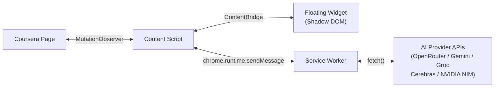

# Auto-Coursera Chrome Extension

AI-powered answer assistant for Coursera quizzes. It detects questions, sends them to supported AI providers, and helps apply answers.

> **v1.9.1** — Floating widget, in-page settings overlay, multi-provider AI, scoped runtime state, and encrypted key storage.

## Table of Contents

- [Features](#features)
- [Tech Stack](#tech-stack)
- [Quick Start](#quick-start)
- [Development](#development)
- [Project Structure](#project-structure)
- [Architecture](#architecture)
- [Governance](#governance)
- [Supported Models](#supported-models)
- [Security](#security)
- [License](#license)

## Features

### Core capabilities

- **Floating widget + in-page settings overlay** — Primary Coursera-page control surfaces for status, scan actions, onboarding, and settings
- **Browser action popup** — Compact fallback surface that reuses the same runtime/settings semantics
- **Automatic Question Detection** — `MutationObserver` monitors for quiz questions in real time
- **Multi-Provider AI** — OpenRouter, Gemini, Groq, Cerebras, and NVIDIA NIM with automatic fallback
- **Image Support** — Extracts and processes image-based questions via vision models
- **Smart Answer Selection** — Confidence-based auto-click or highlight-only mode
- **Encrypted Storage** — API keys encrypted with AES-256-GCM at rest
- **Rate Limiting** — Token-bucket rate limiter reduces API throttling risk
- **Floating Widget** — Always-visible pill on Coursera pages with real-time status (disabled / idle / processing / active / error). Click to expand into a full control panel with toggle, stats, error display, and action buttons
- **In-Page Settings** — Configure API keys, models, and behavior in a modal overlay without leaving the quiz page
- **Context-Aware Popup** — Compact controls on Coursera pages, guidance message on non-Coursera pages
- **Drag & Position** — Widget is draggable with edge snapping and position persistence across sessions
- **Shadow DOM Isolation** — All injected UI lives in a closed Shadow DOM, fully isolated from page styles
- **Accessibility** — 26 ARIA attributes, focus trap, keyboard navigation, and reduced motion support
- **Scoped Runtime State** — Background-owned page/runtime scopes for batch solve tracking, cancellation, and apply-outcome reporting
- **Dedicated Test Connection Path** — Settings surfaces can validate staged provider settings without mutating live quiz runtime state
- **Shared Settings Domain** — The in-page settings overlay and widget onboarding all read from the same provider catalog, key-masking logic, staged save/test payload builders, and onboarding predicate

## Tech Stack

- **TypeScript 5.x** — Strict mode, full type safety
- **Chrome Extension Manifest V3** — Service worker architecture
- **Webpack 5** — Multi-entry bundling for background, content, popup
- **Vitest** — Unit testing with JSDOM support
- **Web Crypto API** — Native encryption, zero dependencies

## Quick Start

### Prerequisites
- Node.js 20+
- pnpm 9+

### Install & Build

```bash
pnpm install
pnpm build       # Local development build
pnpm build:prod  # Production/release build
```

### Load in Chrome

1. Open `chrome://extensions/`
2. Enable **Developer mode**
3. Click **Load unpacked**
4. Select the `dist/` folder

### Configure

In `v1.8.0`, the primary controls are available directly on supported Coursera quiz pages:

1. Navigate to any Coursera quiz page
2. Click the floating **Auto-Coursera** pill at the bottom-right of the page
3. Click **⚙️ Settings** in the panel footer — a settings overlay opens on top of the page
4. Enter your **OpenRouter API key** ([get one here](https://openrouter.ai/keys))
5. Optionally enter keys for **NVIDIA NIM**, **Gemini**, **Groq**, or **Cerebras**
6. Select preferred models and primary provider
7. Adjust confidence threshold and behavior settings
8. Click **Save Settings** and enable the extension via the toggle

> **Tip:** You can also access settings from the browser action popup — on non-Coursera pages, clicking Settings opens a Coursera tab where the overlay is available.

## Development

```bash
pnpm dev        # Watch mode (auto-rebuild on changes)
pnpm build      # One-off development build
pnpm build:prod # Production/release build
pnpm typecheck  # TypeScript type checking
pnpm test       # Run unit tests
pnpm lint       # Biome lint
pnpm format     # Biome format
```

## Project Structure

```
src/
├── background/       # Service worker wiring + focused background modules
│   ├── background.ts       # Thin bootstrap: dependency composition + Chrome listener wiring
│   ├── message-handlers.ts # Message routing, payload validation, sender authorization
│   ├── lifecycle.ts        # Startup/install/alarm/storage/command/tab orchestration
│   ├── provider-service.ts # Live provider init/reload + staged test contexts
│   └── runtime-state.ts    # Mutable scoped runtime write model + scope resolution + recovery
├── content/          # Content scripts (DOM interaction)
│   ├── content.ts           # Entry point, batch solve/apply orchestration, widget mount
│   ├── bridge.ts            # ContentBridge for widget ↔ content communication
│   ├── constants.ts         # DOM selectors, data attributes, debounce values
│   ├── detector.ts          # MutationObserver question detection
│   ├── extractor.ts         # DOM data extraction (text, options, images)
│   ├── orchestrator.ts      # Batch solve/apply orchestration flow
│   ├── question-contract.ts # Canonical selectionMode + image-presence helpers
│   └── selector.ts          # Answer click simulation
├── runtime/          # Shared runtime UI read-model layer
│   └── projection.ts # Canonical popup/widget projection over scoped runtime state
├── services/         # AI provider integrations
│   ├── ai-provider.ts      # Strategy pattern provider manager
│   ├── base-provider.ts    # Abstract base class for providers
│   ├── constants.ts         # API URLs, AI params, retry/timeout config
│   ├── openrouter.ts        # OpenRouter API client (unique auth/routing)
│   ├── provider-registry.ts # Config-driven provider factory (Gemini, Groq, Cerebras, NVIDIA NIM)
│   ├── prompt-engine.ts     # Canonical batch prompt construction
│   ├── response-parser.ts   # AI response parsing and extraction
│   └── image-pipeline.ts    # CORS-aware image processing
├── ui/               # Floating widget UI (Shadow DOM)
│   ├── widget-types.ts      # State interfaces and event types
│   ├── widget-state.ts      # Reactive store (EventTarget pub/sub)
│   ├── styles/              # Modular CSS-in-TS for Shadow DOM injection
│   │   ├── index.ts         #   Barrel — composes getWidgetStyleSheet()
│   │   ├── base.ts          #   Reset, design tokens (light+dark), utilities
│   │   ├── fab.ts           #   FAB pill button, state variants, tooltip
│   │   ├── panel.ts         #   Panel layout, controls, stats, buttons
│   │   ├── overlay.ts       #   Settings overlay, form elements
│   │   └── animations.ts    #   Keyframes, reduced-motion overrides
│   ├── overlay-helpers.ts   # Shared overlay utilities
│   ├── widget-host.ts       # Shadow DOM container + drag engine
│   ├── widget-fab.ts        # Contextual pill FAB (52×32px)
│   ├── widget-panel.ts      # Expanded control panel (320×480px)
│   └── settings-overlay.ts  # In-page settings modal
├── settings/         # Shared settings-domain owner for all settings surfaces
│   └── domain.ts     # Provider metadata, staged workflow controller, onboarding + save/test logic
├── popup/            # Browser action popup (slim fallback surface in v1.8.0)
│   ├── popup.html/css/ts
├── types/            # TypeScript type definitions
│   ├── api.ts             # Provider batch request/response + chat content types
│   ├── messages.contract.ts # Message payload shape validators
│   ├── messages.ts        # Typed Chrome messaging contracts + boundary guards
│   ├── questions.ts       # Question/answer types for detect/extract/apply flow
│   ├── runtime.ts         # Shared page/runtime scope types
│   └── settings.ts        # App settings types
└── utils/            # Shared utilities
    ├── abort.ts           # Shared abort/cancellation helpers
    ├── clipboard.ts       # Clipboard interaction utilities
    ├── constants.ts       # Cross-cutting error codes + colors
    ├── error-messages.ts  # User-friendly error message mapping
    ├── logger.ts          # Structured logging with sanitization
    ├── circuit-breaker.ts # Circuit breaker for API resilience
    ├── rate-limiter.ts    # Token-bucket rate limiter
    └── storage.ts         # AES-GCM encrypted storage
```

## Architecture

> This section describes the extension architecture.

The extension enforces these flow boundaries:

- **Background bootstrap split** — `background.ts` wires the worker and delegates behavior to focused background modules
- **Shared runtime projection** — popup and widget use one read-model layer from `runtime/projection.ts`
- **Shared page/runtime scope types** — content, background, and widget runtime binding reuse one page/request scope contract instead of local wrapper shapes
- **Canonical batch contract** — batch solve/apply uses `selectionMode` (`single`, `multiple`, `text-input`, `unknown`) as the modality field
- **Shared settings workflow** — the settings overlay reuses `createSettingsWorkflowController()` from `settings/domain.ts`, and staged connection tests reuse the same batch provider path as live solving



The floating widget lives in a closed Shadow DOM and communicates with the content script via a `ContentBridge` interface (scan, retry, refresh). All API calls originate from the service worker, which keeps the page isolated from provider credentials and page CSP concerns. Content scripts handle DOM interaction, batch extraction, answer application, and widget orchestration.

Runtime state for active Coursera pages is background-owned and scoped per tab/page instance. Content scripts register the current page context, send `runtimeContext` metadata with each batch solve, and report apply/cancel/error outcomes back to the service worker. The popup and floating widget no longer derive runtime semantics independently; both consume the same projection layer so disabled, idle, stale, active, and error states stay aligned. Scoped batch cancellation also covers disable-time batch dropping, closed-tab teardown, service-worker restart hydration from scoped storage, and timed recovery when a solved batch never reports its apply outcome back to the service worker.

For solve/apply, the canonical batch modality field is `selectionMode`. It is derived in `content/question-contract.ts`, sent in batch payloads, validated at the `SOLVE_BATCH` background boundary, and interpreted by `prompt-engine.ts`. Image presence stays separate from answer modality.

For settings, the **Test Connection** button in the settings overlay uses a dedicated isolated path that exercises the selected provider configuration without mutating live runtime counters, status, or badge state. That staged verification now reuses the same one-question batch provider contract as live solving instead of depending on a separate single-question provider surface. The settings overlay and widget onboarding banner depend on a single shared settings-domain module, while `background/provider-service.ts` remains the live provider authority.

## Governance

- **Current contributor rules:** [`../docs/EXTENSION-GOVERNANCE.md`](../docs/EXTENSION-GOVERNANCE.md)
- **Repository architecture:** [`../docs/ARCHITECTURE.md`](../docs/ARCHITECTURE.md)
- **Release history:** [`CHANGELOG.md`](../CHANGELOG.md)

## Supported Models

| Provider | Model | Best For |
|----------|-------|----------|
| OpenRouter | google/gemini-2.0-flash-001 | Fast text MCQ |
| OpenRouter | openai/gpt-4o | Complex reasoning |
| OpenRouter | anthropic/claude-sonnet-4 | Nuanced academic content |
| NVIDIA NIM | nvidia/llama-3.2-nv-vision-instruct | Image/diagram questions |

## Security

- API keys encrypted with AES-256-GCM (PBKDF2 key derivation, 100k iterations)
- Keys never logged or exposed in error messages
- All API calls over HTTPS only
- No `innerHTML` — DOM modifications via attributes and `click()` only
- Minimal permissions (no `<all_urls>`)

## License

[MIT](../LICENSE) © 2024-2026 nicx
