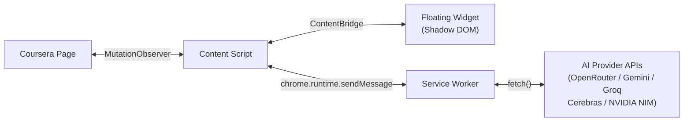

# Auto-Coursera Chrome Extension

AI-powered answer assistant for Coursera quizzes. It detects questions, sends them to supported AI providers, and helps apply answers.

> **Current release:** **`v1.9.1`** includes the floating widget, in-page settings overlay, slim popup fallback, and scoped runtime-state model, now packaged on the synchronized canonical release line.

## Features

### Core capabilities

- **Browser action popup + options page** — Current published control surfaces for scan actions, provider status, and settings
- **Automatic Question Detection** — `MutationObserver` monitors for quiz questions in real time
- **Multi-Provider AI** — OpenRouter, Gemini, Groq, Cerebras, and NVIDIA NIM with automatic fallback
- **Image Support** — Extracts and processes image-based questions via vision models
- **Smart Answer Selection** — Confidence-based auto-click or highlight-only mode
- **Encrypted Storage** — API keys encrypted with AES-256-GCM at rest
- **Rate Limiting** — Token-bucket rate limiter reduces API throttling risk

### New in v1.8.0

- **Floating Widget** — Always-visible pill on Coursera pages with real-time status (disabled / idle / processing / active / error). Click to expand into a full control panel with toggle, stats, error display, and action buttons
- **In-Page Settings** — Configure API keys, models, and behavior in a modal overlay without leaving the quiz page
- **Context-Aware Popup** — Compact controls on Coursera pages, guidance message on non-Coursera pages
- **Drag & Position** — Widget is draggable with edge snapping and position persistence across sessions
- **Shadow DOM Isolation** — All injected UI lives in a closed Shadow DOM, fully isolated from page styles
- **Accessibility** — 26 ARIA attributes, focus trap, keyboard navigation, and reduced motion support
- **Scoped Runtime State** — Background-owned page/runtime scopes for batch solve tracking, cancellation, and apply-outcome reporting
- **Dedicated Test Connection Path** — Settings surfaces can validate staged provider settings without mutating live quiz runtime state
- **Shared Settings Domain** — The in-page settings overlay, fallback options page, and widget onboarding all read from the same provider catalog, key-masking logic, staged save/test payload builders, and onboarding predicate

## Tech Stack

- **TypeScript 5.x** — Strict mode, full type safety
- **Chrome Extension Manifest V3** — Service worker architecture
- **Webpack 5** — Multi-entry bundling for background, content, popup, options
- **Vitest** — Unit testing with JSDOM support
- **Web Crypto API** — Native encryption, zero dependencies

## Quick Start

### Prerequisites
- Node.js 18+
- pnpm 9+

### Install & Build

```bash
pnpm install
pnpm build
```

### Load in Chrome

1. Open `chrome://extensions/`
2. Enable **Developer mode**
3. Click **Load unpacked**
4. Select the `dist/` folder

### Configure

In `v1.8.0`, the primary controls are available directly on supported Coursera quiz pages:

1. Navigate to any Coursera quiz page
2. Click the floating **Auto-Coursera** pill at the bottom-right of the page
3. Click **⚙️ Settings** in the panel footer — a settings overlay opens on top of the page
4. Enter your **OpenRouter API key** ([get one here](https://openrouter.ai/keys))
5. Optionally enter keys for **NVIDIA NIM**, **Gemini**, **Groq**, or **Cerebras**
6. Select preferred models and primary provider
7. Adjust confidence threshold and behavior settings
8. Click **Save Settings** and enable the extension via the toggle

> **Tip:** You can also access settings from the browser action popup or the dedicated options page (`chrome://extensions` → Auto-Coursera → Details → Extension options).

## Development

```bash
pnpm dev        # Watch mode (auto-rebuild on changes)
pnpm build      # Production build
pnpm typecheck  # TypeScript type checking
pnpm test       # Run unit tests
pnpm lint       # Biome lint
pnpm format     # Biome format
```

## Project Structure

```
src/
├── background/       # Service worker (API calls, message routing)
│   ├── background.ts # Entry point, lifecycle, provider init
│   └── router.ts     # Message type → handler mapping
├── content/          # Content scripts (DOM interaction)
│   ├── content.ts    # Entry point, bootstraps modules
│   ├── detector.ts   # MutationObserver question detection
│   ├── extractor.ts  # DOM data extraction (text, options, images)
│   └── selector.ts   # Answer click simulation
├── services/         # AI provider integrations
│   ├── ai-provider.ts    # Strategy pattern provider manager
│   ├── base-provider.ts  # Abstract base class for providers
│   ├── openrouter.ts     # OpenRouter API client
│   ├── gemini.ts         # Google Gemini API client
│   ├── groq.ts           # Groq API client
│   ├── cerebras.ts       # Cerebras API client
│   ├── nvidia-nim.ts     # NVIDIA NIM API client
│   ├── prompt-engine.ts  # Question-type-specific prompts
│   ├── response-parser.ts # AI response parsing and extraction
│   └── image-pipeline.ts # CORS-aware image processing
├── ui/               # Floating widget UI shipped in the v1.8.0 release line
│   ├── widget-types.ts   # State interfaces and event types
│   ├── widget-state.ts   # Reactive store (EventTarget pub/sub)
│   ├── widget-styles.ts  # CSS-in-TS for Shadow DOM injection
│   ├── widget-host.ts    # Shadow DOM container + drag engine
│   ├── widget-fab.ts     # Contextual pill FAB (52×32px)
│   ├── widget-panel.ts   # Expanded control panel (320×480px)
│   └── settings-overlay.ts # In-page settings modal
├── settings/         # Shared settings-domain owner for all settings surfaces
│   └── domain.ts     # Provider metadata, key masking, save/test staging, onboarding rules
├── popup/            # Browser action popup (slim fallback surface in v1.8.0)
│   ├── popup.html/css/ts
├── options/          # Settings page (public release surface and fallback)
│   ├── options.html/css/ts
├── types/            # TypeScript type definitions
│   ├── api.ts        # AI request/response types
│   ├── messages.ts   # Chrome messaging types
│   ├── questions.ts  # Question/answer types
│   └── settings.ts   # App settings types
└── utils/            # Shared utilities
    ├── constants.ts       # Selectors, URLs, error codes
    ├── error-messages.ts  # User-friendly error message mapping
    ├── logger.ts          # Structured logging with sanitization
    ├── circuit-breaker.ts # Circuit breaker for API resilience
    ├── rate-limiter.ts    # Token-bucket rate limiter
    └── storage.ts         # AES-GCM encrypted storage
```

## Architecture

> This section describes the **`v1.8.0` extension architecture**.



In the `v1.8.0` release line, the floating widget lives in a closed Shadow DOM, communicating with the content script via a `ContentBridge` interface (scan, retry, refresh). All API calls originate from the service worker (bypasses page CSP). Content scripts handle DOM interaction and widget orchestration.

Runtime state for active Coursera pages is background-owned and scoped per tab/page instance in `v1.8.0`. Content scripts register the current page context, send `runtimeContext` metadata with each batch solve, and report apply/cancel/error outcomes back to the service worker. The popup now reads the active tab's scoped runtime state directly, and the floating widget is bound to the current page scope instead of a flattened session summary. Scoped batch cancellation also covers disable-time batch dropping, closed-tab cleanup, service-worker restart hydration from scoped storage, and timed recovery when a solved batch never reports its apply outcome back to the service worker. The **Test Connection** buttons in both settings surfaces use a dedicated isolated path that exercises the selected provider configuration without mutating live quiz runtime counters, status, or badge state. The settings overlay, fallback options page, and widget onboarding banner now all depend on a single shared settings-domain module, so provider catalogs, masked-key handling, staged save/test payloads, and onboarding semantics remain in sync.

## Supported Models

| Provider | Model | Best For |
|----------|-------|----------|
| OpenRouter | google/gemini-2.0-flash-001 | Fast text MCQ |
| OpenRouter | openai/gpt-4o | Complex reasoning |
| OpenRouter | anthropic/claude-sonnet-4 | Nuanced academic content |
| NVIDIA NIM | nvidia/llama-3.2-nv-vision-instruct | Image/diagram questions |

## Security

- API keys encrypted with AES-256-GCM (PBKDF2 key derivation, 100k iterations)
- Keys never logged or exposed in error messages
- All API calls over HTTPS only
- No `innerHTML` — DOM modifications via attributes and `click()` only
- Minimal permissions (no `<all_urls>`)

## License

[MIT](../LICENSE) © 2024-2026 nicx
