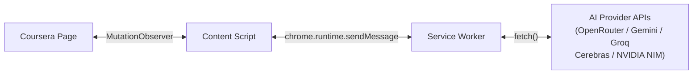

# Auto-Coursera Chrome Extension

AI-powered answer assistant for e-learning platforms. Detects quiz questions on Coursera, sends them to AI providers (OpenRouter / NVIDIA NIM), and auto-selects correct answers.

## Features

- **Automatic Question Detection** — MutationObserver monitors for quiz questions in real-time
- **Multi-Provider AI** — OpenRouter, Gemini, Groq, Cerebras, NVIDIA NIM with automatic fallback
- **Image Support** — Extracts and processes image-based questions via vision models
- **Smart Answer Selection** — Confidence-based auto-click or highlight-only mode
- **Encrypted Storage** — API keys encrypted with AES-256-GCM at rest
- **Rate Limiting** — Token-bucket rate limiter prevents API throttling

## Tech Stack

- **TypeScript 5.x** — Strict mode, full type safety
- **Chrome Extension Manifest V3** — Service worker architecture
- **Webpack 5** — Multi-entry bundling for background, content, popup, options
- **Vitest** — Unit testing with JSDOM support
- **Web Crypto API** — Native encryption, zero dependencies

## Quick Start

### Prerequisites
- Node.js 18+
- pnpm 9+

### Install & Build

```bash
pnpm install
pnpm build
```

### Load in Chrome

1. Open `chrome://extensions/`
2. Enable **Developer mode**
3. Click **Load unpacked**
4. Select the `dist/` folder

### Configure

1. Click the extension icon → **Settings**
2. Enter your **OpenRouter API key** ([get one here](https://openrouter.ai/keys))
3. Optionally enter **NVIDIA NIM API key**
4. Select preferred models
5. Adjust confidence threshold
6. Save and enable

## Development

```bash
pnpm dev        # Watch mode (auto-rebuild on changes)
pnpm build      # Production build
pnpm typecheck  # TypeScript type checking
pnpm test       # Run unit tests
pnpm lint       # ESLint
pnpm format     # Biome format
```

## Project Structure

```
src/
├── background/       # Service worker (API calls, message routing)
│   ├── background.ts # Entry point, lifecycle, provider init
│   └── router.ts     # Message type → handler mapping
├── content/          # Content scripts (DOM interaction)
│   ├── content.ts    # Entry point, bootstraps modules
│   ├── detector.ts   # MutationObserver question detection
│   ├── extractor.ts  # DOM data extraction (text, options, images)
│   └── selector.ts   # Answer click simulation
├── services/         # AI provider integrations
│   ├── ai-provider.ts    # Strategy pattern provider manager
│   ├── base-provider.ts  # Abstract base class for providers
│   ├── openrouter.ts     # OpenRouter API client
│   ├── gemini.ts         # Google Gemini API client
│   ├── groq.ts           # Groq API client
│   ├── cerebras.ts       # Cerebras API client
│   ├── nvidia-nim.ts     # NVIDIA NIM API client
│   ├── prompt-engine.ts  # Question-type-specific prompts
│   ├── response-parser.ts # AI response parsing and extraction
│   └── image-pipeline.ts # CORS-aware image processing
├── popup/            # Extension popup UI
│   ├── popup.html/css/ts
├── options/          # Settings page
│   ├── options.html/css/ts
├── types/            # TypeScript type definitions
│   ├── api.ts        # AI request/response types
│   ├── messages.ts   # Chrome messaging types
│   ├── questions.ts  # Question/answer types
│   └── settings.ts   # App settings types
└── utils/            # Shared utilities
    ├── constants.ts      # Selectors, URLs, error codes
    ├── logger.ts         # Structured logging with sanitization
    ├── circuit-breaker.ts # Circuit breaker for API resilience
    ├── rate-limiter.ts   # Token-bucket rate limiter
    └── storage.ts        # AES-GCM encrypted storage
```

## Architecture



All API calls originate from the service worker (bypasses page CSP). Content scripts only interact with the DOM.

## Supported Models

| Provider | Model | Best For |
|----------|-------|----------|
| OpenRouter | google/gemini-2.0-flash-001 | Fast text MCQ |
| OpenRouter | openai/gpt-4o | Complex reasoning |
| OpenRouter | anthropic/claude-sonnet-4 | Nuanced academic content |
| NVIDIA NIM | nvidia/llama-3.2-nv-vision-instruct | Image/diagram questions |

## Security

- API keys encrypted with AES-256-GCM (PBKDF2 key derivation, 100k iterations)
- Keys never logged or exposed in error messages
- All API calls over HTTPS only
- No `innerHTML` — DOM modifications via attributes and `click()` only
- Minimal permissions (no `<all_urls>`)

## License

Private — for educational purposes only.
