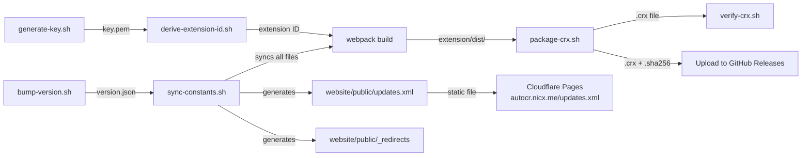

# Auto-Coursera Scripts

Build, signing, and packaging scripts for the CRX extension pipeline. These scripts are used both locally and by CI/CD workflows.

---

## Scripts

### 🔑 `generate-key.sh` — Generate Signing Key

Creates an RSA 2048 private key for CRX signing and derives the extension ID.

```bash
./scripts/generate-key.sh                 # Outputs extension-key.pem
./scripts/generate-key.sh -o my-key.pem   # Custom output path
```

| Flag | Default | Description |
|---|---|---|
| `-o <file>` | `extension-key.pem` | Output file path |
| `-h` | — | Show help |

**Requires:** `openssl`, `xxd`

---

### 🆔 `derive-extension-id.sh` — Derive Extension ID

Computes the 32-character Chrome extension ID from an existing private key.

```bash
./scripts/derive-extension-id.sh extension-key.pem
# → abcdefghijklmnopabcdefghijklmnop
```

The algorithm:
1. Extract public key in DER format
2. SHA256 hash of the DER bytes
3. First 32 hex characters → mapped `0-f` → `a-p`

**Requires:** `openssl`, `xxd`

---

### 📦 `package-crx.sh` — Package CRX3

Builds a signed CRX3 file from the extension dist directory using `npx crx3`.

```bash
./scripts/package-crx.sh -v <version> -k extension-key.pem
./scripts/package-crx.sh -v <version> -k extension-key.pem -s extension/dist -o releases/
```

| Flag | Default | Description |
|---|---|---|
| `-v <version>` | *required* | Extension version |
| `-k <key-file>` | *required* | RSA private key PEM file |
| `-s <source-dir>` | `extension/dist` | Extension source directory |
| `-o <output-dir>` | project root | Output directory |
| `-h` | — | Show help |

**Output:**
- `auto_coursera_<version>.crx` — signed CRX3 file
- `auto_coursera_<version>.crx.sha256` — SHA256 checksum

**Requires:** `openssl`, `npx crx3`, `sha256sum`

---

### ✅ `verify-crx.sh` — Verify CRX3

Validates a CRX file by checking magic bytes, format version, manifest, and checksum.

```bash
./scripts/verify-crx.sh auto_coursera_<version>.crx
```

**Checks performed:**
1. File exists and is readable
2. CRX3 magic bytes (`Cr24`)
3. CRX format version
4. Embedded manifest version
5. File size
6. SHA256 checksum

**Requires:** `xxd`, `sha256sum`, `unzip`

---

### 📋 `generate-updates-xml.sh` — Generate Update Manifest

Produces a local/manual `updates.xml` fixture for testing browser policy installs.
Production serves a **static** `updates.xml` file at `https://autocr.nicx.me/updates.xml` via Cloudflare Pages, generated by `sync-constants.sh` from `version.json`.

```bash
./scripts/generate-updates-xml.sh \
  -i abcdefghijklmnopabcdefghijklmnop \
  -v <version> \
  -u https://github.com/NICxKMS/auto-coursera/releases/download/v<version>/auto_coursera_<version>.crx

# Write to file
./scripts/generate-updates-xml.sh -i <id> -v <version> -u <url> -o updates.xml
```

| Flag | Default | Description |
|---|---|---|
| `-i <extension-id>` | *required* | 32-character extension ID |
| `-v <version>` | *required* | Extension version |
| `-u <crx-url>` | *required* | Full URL to the CRX file |
| `-o <output-file>` | stdout | Output file path |
| `-h` | — | Show help |

**Output format:**
```xml
<?xml version="1.0" encoding="UTF-8"?>
<gupdate xmlns="http://www.google.com/update2/response" protocol="2.0">
  <app appid="EXTENSION_ID">
    <updatecheck codebase="CRX_URL" version="VERSION"/>
  </app>
</gupdate>
```

Use this script only for local/manual validation or troubleshooting. The canonical `updates.xml` is generated by `sync-constants.sh` as a static file and deployed via Cloudflare Pages — this standalone script is not part of the production release workflow.

---

### 🎨 `generate-icons.js` — Generate Icon Placeholders

Creates minimal valid PNG icon placeholders in Coursera-blue (`#0056D2`) for all required sizes.

```bash
node scripts/generate-icons.js
```

Generates `16×16`, `32×32`, `48×48`, and `128×128` PNGs to `extension/assets/icons/`.

**Requires:** Node.js (no external dependencies — uses `zlib` from stdlib)

---

### 🔄 `bump-version.sh` — Bump Version & Sync All Constants

Updates the version in `version.json`, then delegates to `sync-constants.sh` to propagate **all constants** (version, extensionId, extensionName, updateUrl, domains) across the entire monorepo.

```bash
./scripts/bump-version.sh <new-version>
```

**Requires:** `jq`, `sed`

---

### 🔁 `sync-constants.sh` — Sync All Constants from `version.json`

Reads **every field** from `version.json` (version, extensionId, extensionName, updateUrl, domains) and propagates them to all target files. Idempotent — safe to run multiple times.

```bash
./scripts/sync-constants.sh
```

**Syncs to:**
- `extension/package.json`, `extension/manifest.json`, `website/package.json` (version)
- `installer/config.go` (AppVersion, ExtensionID, ExtensionName, UpdateURL)
- `website/public/scripts/install.sh`, `install-mac.sh` (EXTENSION_ID, EXTENSION_NAME, UPDATE_URL)
- `website/public/scripts/uninstall.sh`, `uninstall.ps1` (EXTENSION_ID, EXTENSION_NAME)
- `website/public/scripts/install.ps1` (EXTENSION_ID, EXTENSION_NAME, UPDATE_URL)
- `website/astro.config.mjs` (site domain)
- `website/public/_redirects` (generated installer shortcut URLs)
- `website/public/updates.xml` (generated from extensionId, version, githubRepo)

The website's `/install` and `/downloads` pages are not directly rewritten by `sync-constants.sh`; they read the root `version.json` at build time so their GitHub Release links stay canonical without a manual edit step.

**Requires:** `jq`, `sed`

---

### ✅ `check-version.sh` — Verify All Constants Match `version.json`

CI guard that validates **all constants** — version, extension ID, extension name, update URL, and domains — are consistent across every file in the monorepo, plus a few operational truth guards for the deployment branch and website source links. Runs **53 checks**.

```bash
./scripts/check-version.sh
```

**Checks:**
- **Version** — JSON packages and Go config
- **Extension ID** — Go config, 3 install scripts, 2 uninstall scripts, 2 docs pages
- **Extension Name** — Go config, manifest.json, 3 install scripts, 2 uninstall scripts
- **Update URL** — Go config, 3 install scripts, 1 docs page
- **Domains** — Astro config (site), website domain in docs pages
- **Static website release surfaces** — `website/public/updates.xml` contents, `website/public/_redirects` targets, install/download page version-truth wiring, domain references in manual docs
- **Policy filename consistency** — Go installer matches shell install script
- **Operational truth guards** — deployment branch references in workflow/docs/website README, plus the website footer GitHub license link branch
- **Git tag** — Validates against `version.json` in CI

**Requires:** `jq`, `grep`, `sed`

---

## Typical Workflow



`generate-updates-xml.sh` is retained as a standalone manual/testing helper. The canonical `updates.xml` and release-download shortcuts are generated by `sync-constants.sh` and served as static files via Cloudflare Pages.

## Prerequisites

All scripts require a Unix shell (bash). On Windows, use WSL or Git Bash.

| Tool | Used By | Install |
|---|---|---|
| `openssl` | key, id, package | Pre-installed on most systems |
| `xxd` | id, verify | Usually bundled with `vim` |
| `sha256sum` | package, verify | Pre-installed on Linux; `shasum -a 256` on macOS |
| `npx crx3` | package | `npm install -g crx3` or use `npx` |
| `jq` | bump-version, sync-constants, check-version | `apt install jq` / `brew install jq` |
| `Node.js` | icons | v18+ recommended |

## Related Documentation

- [`docs/SIGNING.md`](../docs/SIGNING.md) — Full explanation of CRX3 signing and extension ID derivation
- [`docs/ARCHITECTURE.md`](../docs/ARCHITECTURE.md#release-flow) — How scripts fit into the release pipeline
