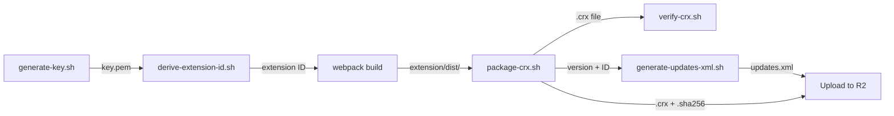

# Auto-Coursera Scripts

Build, signing, and packaging scripts for the CRX extension pipeline. These scripts are used both locally and by CI/CD workflows.

---

## Scripts

### 🔑 `generate-key.sh` — Generate Signing Key

Creates an RSA 2048 private key for CRX signing and derives the extension ID.

```bash
./scripts/generate-key.sh                 # Outputs extension-key.pem
./scripts/generate-key.sh -o my-key.pem   # Custom output path
```

| Flag | Default | Description |
|---|---|---|
| `-o <file>` | `extension-key.pem` | Output file path |
| `-h` | — | Show help |

**Requires:** `openssl`, `xxd`

---

### 🆔 `derive-extension-id.sh` — Derive Extension ID

Computes the 32-character Chrome extension ID from an existing private key.

```bash
./scripts/derive-extension-id.sh extension-key.pem
# → abcdefghijklmnopabcdefghijklmnop
```

The algorithm:
1. Extract public key in DER format
2. SHA256 hash of the DER bytes
3. First 32 hex characters → mapped `0-f` → `a-p`

**Requires:** `openssl`, `xxd`

---

### 📦 `package-crx.sh` — Package CRX3

Builds a signed CRX3 file from the extension dist directory using `npx crx3`.

```bash
./scripts/package-crx.sh -v 1.7.5 -k extension-key.pem
./scripts/package-crx.sh -v 1.7.5 -k extension-key.pem -s extension/dist -o releases/
```

| Flag | Default | Description |
|---|---|---|
| `-v <version>` | *required* | Extension version |
| `-k <key-file>` | *required* | RSA private key PEM file |
| `-s <source-dir>` | `extension/dist` | Extension source directory |
| `-o <output-dir>` | project root | Output directory |
| `-h` | — | Show help |

**Output:**
- `auto-coursera_<version>.crx` — signed CRX3 file
- `auto-coursera_<version>.crx.sha256` — SHA256 checksum

**Requires:** `openssl`, `npx crx3`, `sha256sum`

---

### ✅ `verify-crx.sh` — Verify CRX3

Validates a CRX file by checking magic bytes, format version, manifest, and checksum.

```bash
./scripts/verify-crx.sh auto-coursera_1.7.5.crx
```

**Checks performed:**
1. File exists and is readable
2. CRX3 magic bytes (`Cr24`)
3. CRX format version
4. Embedded manifest version
5. File size
6. SHA256 checksum

**Requires:** `xxd`, `sha256sum`, `unzip`

---

### 📋 `generate-updates-xml.sh` — Generate Update Manifest

Produces the `updates.xml` file Chrome checks for auto-updates.

```bash
./scripts/generate-updates-xml.sh \
  -i abcdefghijklmnopabcdefghijklmnop \
  -v 1.7.5 \
  -u https://cdn.autocr.nicx.app/releases/auto_coursera_1.7.5.crx

# Write to file
./scripts/generate-updates-xml.sh -i <id> -v 1.7.5 -u <url> -o updates.xml
```

| Flag | Default | Description |
|---|---|---|
| `-i <extension-id>` | *required* | 32-character extension ID |
| `-v <version>` | *required* | Extension version |
| `-u <crx-url>` | *required* | Full URL to the CRX file |
| `-o <output-file>` | stdout | Output file path |
| `-h` | — | Show help |

**Output format:**
```xml
<?xml version="1.0" encoding="UTF-8"?>
<gupdate xmlns="http://www.google.com/update2/response" protocol="2.0">
  <app appid="EXTENSION_ID">
    <updatecheck codebase="CRX_URL" version="VERSION"/>
  </app>
</gupdate>
```

---

### 🎨 `generate-icons.js` — Generate Icon Placeholders

Creates minimal valid PNG icon placeholders in Coursera-blue (`#0056D2`) for all required sizes.

```bash
node scripts/generate-icons.js
```

Generates `16×16`, `32×32`, `48×48`, and `128×128` PNGs to `extension/assets/icons/`.

**Requires:** Node.js (no external dependencies — uses `zlib` from stdlib)

---

## Typical Workflow



## Prerequisites

All scripts require a Unix shell (bash). On Windows, use WSL or Git Bash.

| Tool | Used By | Install |
|---|---|---|
| `openssl` | key, id, package | Pre-installed on most systems |
| `xxd` | id, verify | Usually bundled with `vim` |
| `sha256sum` | package, verify | Pre-installed on Linux; `shasum -a 256` on macOS |
| `npx crx3` | package | `npm install -g crx3` or use `npx` |
| `Node.js` | icons | v18+ recommended |

## Related Documentation

- [`docs/SIGNING.md`](../docs/SIGNING.md) — Full explanation of CRX3 signing and extension ID derivation
- [`docs/ARCHITECTURE.md`](../docs/ARCHITECTURE.md#release-flow) — How scripts fit into the release pipeline
